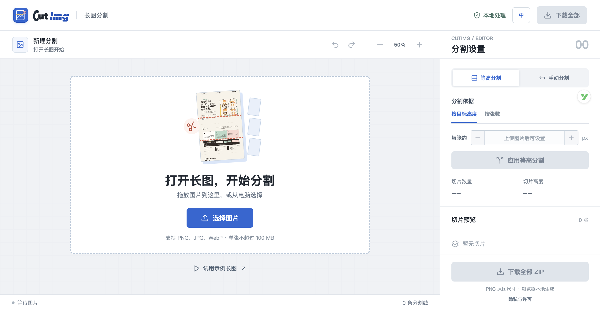
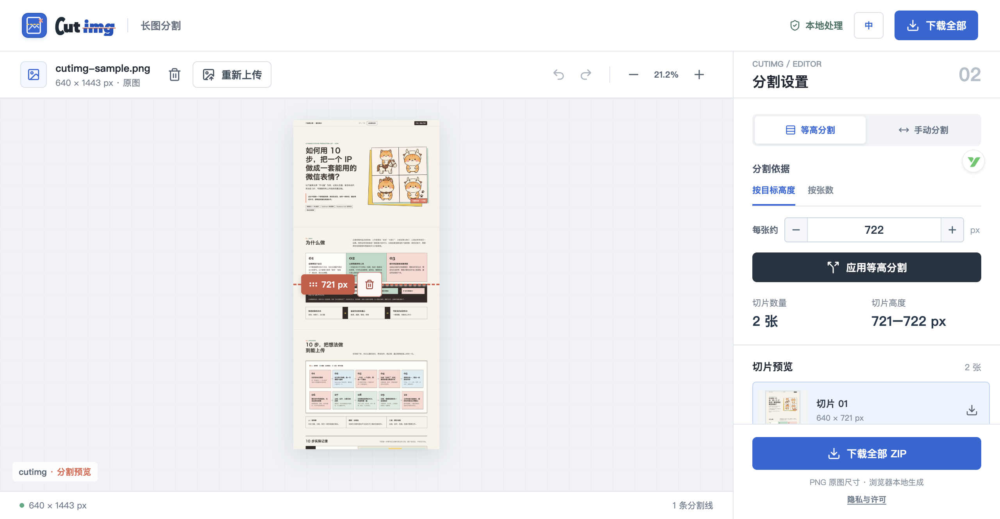
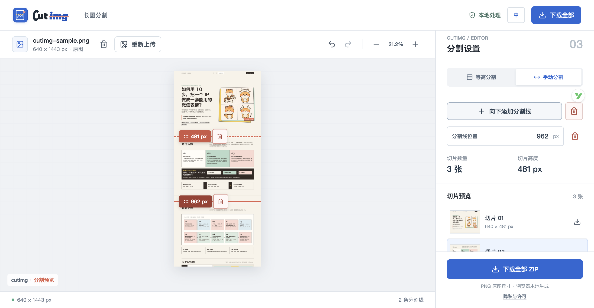

# cutimg

一款将图片精准分割成矮图的在线工具。图片内容只在当前浏览器本地处理，不会上传到 Cutimg 的图片处理服务。

## 功能

- 支持 PNG、JPG、WebP 的拖放、选择和粘贴，并提供内置示例长图。
- 支持按目标高度或张数等高分割；数值可以直接输入，也可以使用步进按钮调整。
- 支持手动添加、拖动、键盘微调和删除分割线，并提供撤销与重做。
- 图片默认以不超过 50% 的比例完整适配预览区，仍可继续缩放检查细节。
- 每张切片可单独下载为 PNG，也可以一次打包下载 ZIP。
- 导出保持原图宽度，切片之间没有缩放、重叠或空缺。
- 支持中文与英文手动切换，并保存用户选择；在 Cloudflare Pages 上，地域拦截先于页面加载生效，其他地区默认英文；没有地域接口时回退到浏览器语言。

浏览器处理超大图片时受设备内存和 Canvas 限制。当前输入上限为 100 MB / 1.8 亿像素，ZIP 最多包含 100 张；单张输出超过 16,384 px 或 6,500 万像素时需要继续分割。

## 界面预览

以下截图来自当前版本的实际界面，展示从打开长图到导出切片的主要状态。

### 打开长图



### 等高分割



### 手动分割



## 本地运行

```bash
python3 -m http.server 4173
```

打开 `http://127.0.0.1:4173/`。项目没有构建步骤、后端服务或环境变量。

## 测试

核心逻辑测试不需要安装依赖：

```bash
npm test
```

浏览器回归使用 Playwright 和仓库自带示例图：

```bash
npm install
npx playwright install chromium
npm run test:browser
```

## 部署与默认语言

可直接部署到 Cloudflare Pages、GitHub Pages 或其他静态托管平台。发布根目录就是仓库根目录，不需要填写构建命令；请保持 `index.html`、`styles.css`、`app.js`、`i18n.js`、`core.js` 和 `assets/` 的相对目录结构。

如果未来将这份工作树重新部署到 Cloudflare Pages，`functions/_middleware.js` 当前会因 `SERVICE_PAUSED = true` 让所有请求返回 `503`，站点保持暂停；只有将其改为 `false` 并保留地域拦截配置时，Cloudflare 才会对边缘识别为 `CN` 的请求返回 `403`。该策略依赖 IP 地区识别，VPN、代理或识别误差可能导致实际结果不同；在不支持 Cloudflare Pages Functions 的其他静态托管平台上不会自动生效。

当前 Cloudflare Pages 项目已删除，仓库只保留本地代码；重新部署前请重新确认暂停开关、地域策略和隐私说明。

重新部署后，Cloudflare Pages 会加载 `functions/api/country.js`，通过同源 `/api/country` 返回 Cloudflare 提供的两位国家码。页面只在没有手动偏好和有效缓存时请求一次：`CN` 使用中文，其余国家或地区使用英文，结果在浏览器缓存 24 小时。函数不返回或主动记录 IP 地址，但 Cloudflare 作为托管和网络服务商，可能依据其隐私政策处理访问日志、IP 和安全元数据。

GitHub Pages 等纯静态平台没有地域接口，页面会静默退回浏览器语言。用户手动选择的 `中 / EN` 始终具有最高优先级，不受地域结果覆盖。

## 隐私与使用说明

完整文本见 [PRIVACY.md](PRIVACY.md)、[NOTICE.md](NOTICE.md) 和 [DEPLOYMENT.md](DEPLOYMENT.md)。正式公开发布前，应补充真实运营主体、联系邮箱、适用法律和用户权利处理渠道。

- 你选择、拖放或粘贴的图片只在当前设备的浏览器内读取、切割并生成下载文件；图片内容不会上传到 Cutimg 的图片处理服务，也不会被 Cutimg 保存。
- 为选择默认语言，页面可能请求同源 `/api/country` 获取两位国家/地区代码；该接口不接收图片内容。函数本身不读取或记录 IP，Cloudflare 的连接日志和安全处理以其隐私政策为准。
- 使用者应确认对处理的图片拥有合法使用权。超大图片会受到浏览器内存和 Canvas 限制，服务按现状提供，不保证所有设备都能成功导出。

项目源代码采用 [MIT License](LICENSE)。界面图标使用本地打包的 Lucide，授权信息见 [`assets/lucide.LICENSE`](assets/lucide.LICENSE)。品牌 logo、示例图片和文案不因源代码采用 MIT 而自动获得再授权。
